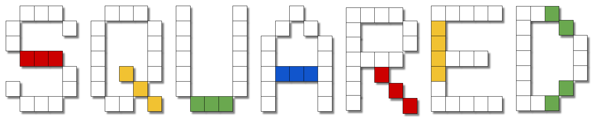

# Squared

Squared is an upcoming multiplayer competitive board-game where the objective is to capture as much of the board as possible.

## Installation
Obtain a copy of [Python3](https://www.python.org/downloads/), [Pip3](https://pip.pypa.io/en/stable/installation/), and then execute:
> pip3 install flask

> pip3 install flask_cors

You'll also need [Node.js](https://nodejs.org/en/download/). Install the requirements after with:
> npm install

## Running Locally
In `Project/Api/flaskapp`, simply execute `flask run`. This will run the API server on `http://localhost:5000`.
Navigate to `Project/Web/squared-web`, then execute `npm start`. This will start the frontend server.

## Project Layout
`Deliverables/` is where assignment deliverables are kept.
`Project` is where the code for the project is kept.
`Project/Api` is the Flask backend of the project.
`Project/Web` is the React frontend of the project.

## Contact
* Keijaoh Campbell (keijaoh.campbell@maine.edu)
* Jeffrey Fosgate (jeffrey.fosgate@maine.edu)
* Jacob Lorenzo (jacob.w.lorenzo@maine.edu)
* Shea Keegan (shea.keegan@maine.edu)
* Tyler Walker (tyler.j.walker@maine.edu)

## License
To be decided next meeting
